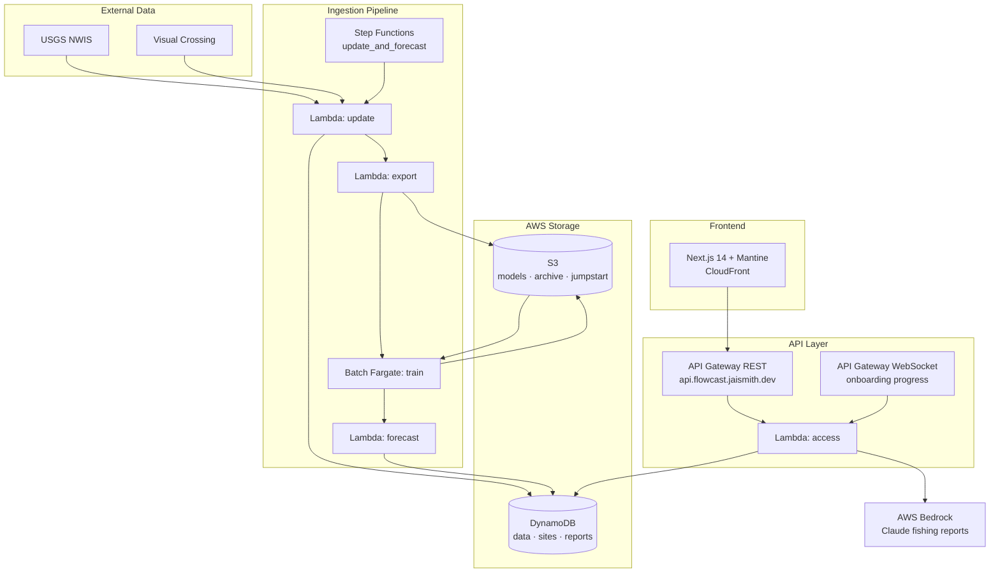

# Flowcast

Hourly water-condition forecasts for USGS monitoring sites — streamflow and water temperature — blended with local weather and surfaced through interactive charts and AI-generated fishing reports.

**Live:** [flowcast.jaismith.dev](https://flowcast.jaismith.dev) · **API:** [api.flowcast.jaismith.dev](https://api.flowcast.jaismith.dev)

---

## Overview

Flowcast ingests real-time observations from the [USGS Water Services API](https://waterservices.usgs.gov/), enriches them with hourly weather from [Visual Crossing](https://www.visualcrossing.com/), and trains per-site [NeuralProphet](https://neuralprophet.com/) models to produce 7-day forecasts with 90% confidence bands.

The default monitored site is **USGS 01427510**. The web UI lets you toggle streamflow vs. water temperature, adjust the viewing window (10 days → 3 months), and overlay historical forecast accuracy at different horizons (6h–2d). Each site page includes a Mapbox map and a daily fishing report generated by Claude on AWS Bedrock.

---

## Architecture



### Scheduled jobs

| Schedule | Action |
|----------|--------|
| Hourly (`:05`) | Step Functions: update data → forecast for site `01427510` |
| Weekly (Sunday 00:00 UTC) | DynamoDB point-in-time export to S3 archive |

### Onboarding a new site

Registering a site via `POST /site/register?usgs_site=<id>` kicks off a Step Functions workflow:

1. **Fetch data** — backfill USGS + weather observations into DynamoDB
2. **Export snapshot** — DynamoDB export to S3 for training
3. **Train models** — AWS Batch (Fargate Spot, 16 vCPU / 32 GB) fits NeuralProphet models for `streamflow` and `watertemp`
4. **Forecast** — run initial inference and mark site `ACTIVE`

Progress streams over WebSocket to connected clients. Site status and logs live in the `flowcast-sites` DynamoDB table.

---

## Repository structure

This is a [Yarn 4](https://yarnpkg.com/) monorepo with three workspaces:

```
flowcast/
├── backend/          # Python 3.10 — Lambda handlers, ML pipeline, data utilities
│   ├── src/
│   │   ├── handlers/ # update · forecast · train · access · export · onboard
│   │   ├── utils/    # usgs · weather · db · s3 · forecast · claude
│   │   └── index.py  # Lambda entrypoints
│   └── Dockerfile    # Shared image for Lambda + Batch
├── client/           # Next.js 14 + Mantine + Visx
│   ├── pages/sites/[site].tsx
│   └── components/   # chart · selector · site detail
├── infra/            # AWS CDK (TypeScript)
│   └── lib/flowcast.ts
├── notebooks/        # Jupyter notebooks for model experimentation
└── .github/workflows/deploy.yml
```

---

## Tech stack

| Layer | Technologies |
|-------|-------------|
| **ML** | NeuralProphet, PyTorch, pandas, scipy |
| **Backend** | Python 3.10, Poetry, AWS Lambda (Docker), AWS Batch, Step Functions |
| **Data** | DynamoDB, S3, USGS NWIS, Visual Crossing |
| **AI reports** | LangChain + Claude 3 Sonnet via AWS Bedrock |
| **Frontend** | Next.js 14, Mantine 7, Visx, Mapbox GL, Zod |
| **Infra** | AWS CDK, cdk-nextjs-standalone, Route 53, CloudFront |

---

## API

Base URL: `https://api.flowcast.jaismith.dev`

| Method | Path | Description |
|--------|------|-------------|
| `GET` | `/forecast?usgs_site=&start_ts=&historical_fcst_horizon=` | Hourly observations + forecasts (optionally with past forecast overlay for accuracy) |
| `GET` | `/site?usgs_site=` | Site metadata (name, coordinates, status) |
| `GET` | `/report?usgs_site=` | Daily AI fishing report (cached in DynamoDB) |
| `POST` | `/site/register?usgs_site=` | Start onboarding workflow; returns WebSocket URL for progress |

---

## Local development

### Prerequisites

- **Node.js** 20+ with [Corepack](https://nodejs.org/api/corepack.html) enabled (`corepack enable`)
- **Yarn** 4 (managed via `.yarnrc.yml`)
- **Python** 3.10
- **Poetry** ([install guide](https://python-poetry.org/docs/#installation))
- **AWS CLI** + credentials (for deploy only)
- **AWS CDK CLI** (`npm install -g aws-cdk`)

### Install

```bash
git clone https://github.com/jaismith/flowcast.git
cd flowcast
yarn install          # installs all workspaces
cd backend && poetry install
```

### Frontend dev server

```bash
yarn workspace @flowcast/client dev
```

The client reads from the production API by default (`client/utils/constants.ts`). To point at a local or staging API, change `ACCESS_API_ROOT`.

Use sample data during development:

```typescript
getForecast(site, startTs, 0, undefined, true)  // useSample = true
```

### Backend (local handler invocation)

```bash
cd backend
poetry run python src/index.py access   # hits access handler with test event
poetry run python src/index.py update
poetry run python src/index.py forecast
```

Set environment variables in a `.env` file at the repo root (loaded by CDK) or export them directly:

| Variable | Purpose |
|----------|---------|
| `VISUAL_CROSSING_API_KEY` | Weather data API key |
| `WEATHER_KEY` | Legacy/alternate weather key |
| `RDS_PASS`, `RDS_HOST` | PostgreSQL (legacy; check usage before relying on) |
| `NCEI_HOST`, `NCEI_EMAIL` | NOAA NCEI access |
| `AWS credentials` | Standard boto3 credential chain for DynamoDB/S3 access |

For full local backend testing against AWS resources, tables and buckets must exist (deploy infra first or use a dev stack).

### Infra

```bash
# Synth CloudFormation template
yarn synth

# Deploy full stack (builds Docker image, Next.js, all AWS resources)
yarn deploy
```

Deploy requires a Route 53 hosted zone for your domain and the secrets listed in `.github/workflows/deploy.yml`.

---

## Deployment

Pushes to `main` trigger [`.github/workflows/deploy.yml`](.github/workflows/deploy.yml), which:

1. Installs Node, Poetry, Python 3.10, and AWS CDK
2. Configures AWS credentials from GitHub Secrets
3. Runs `yarn deploy --require-approval never`

Required GitHub Secrets:

- `AWS_ACCESS_KEY_ID`, `AWS_SECRET_ACCESS_KEY`
- `WEATHER_KEY`, `RDS_PASS`, `RDS_HOST`, `NCEI_HOST`, `NCEI_EMAIL`, `VISUAL_CROSSING_API_KEY`

---

## ML pipeline details

- **Forecast horizon:** 168 hours (7 days), hourly resolution
- **Features forecasted:** `streamflow` (cfs), `watertemp` (°F)
- **Regressors:** precipitation, cloud cover, air temperature, snow, snow depth
- **Model:** NeuralProphet with 4×64 AR layers, 336 lag steps, 90% quantile intervals
- **Training data:** up to ~2.5 years of hourly history per site
- **Artifacts:** models stored in S3 (`model-bucket`), keyed by site + feature

Experimentation and validation live in `notebooks/` (`prep.ipynb`, `predict.ipynb`, `lstm.ipynb`, `validate_prod.ipynb`, etc.).

---

## Configuration notes

- **Domain:** hardcoded in `infra/lib/flowcast.ts` as `flowcast.jaismith.dev` — change `DOMAIN_NAME` for your own deployment
- **Default cron site:** `01427510` in the hourly EventBridge rule
- **Mapbox token:** embedded in `client/components/site.tsx` (consider moving to env var for forks)

---

## Author

Jai Smith — [jksmithnyc@gmail.com](mailto:jksmithnyc@gmail.com)
